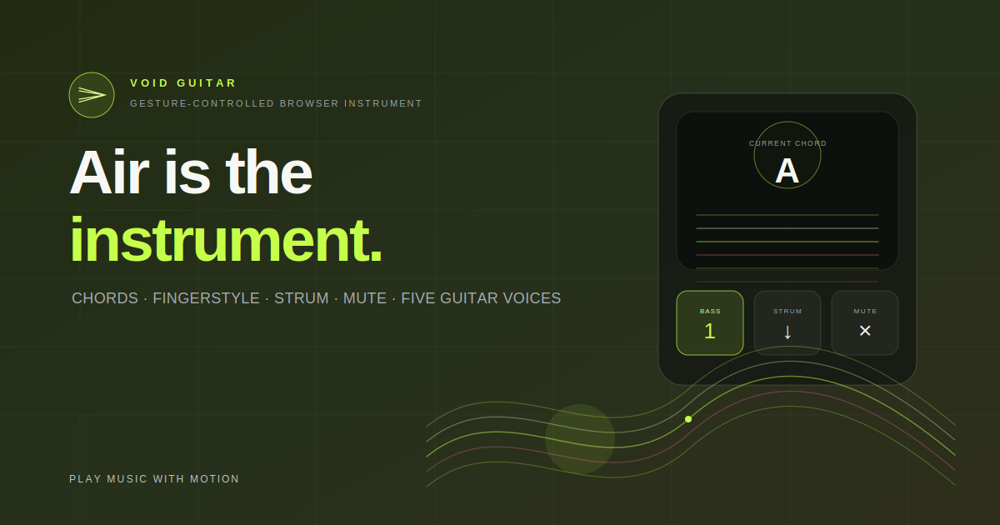

<p align="center">
  
</p>

<h1 align="center">Void Guitar</h1>

<p align="center">
  <strong>Air is the instrument.</strong><br>
  A gesture-controlled guitar for the browser. 一把用手势演奏的浏览器吉他。
</p>

<p align="center">
  <a href="https://himisgood.github.io/void-guitar/">Try the live demo</a>
  &nbsp;·&nbsp;
  <a href="#how-it-works">How it works</a>
  &nbsp;·&nbsp;
  <a href="#run-locally">Run locally</a>
</p>

> Change chords with one hand. Pluck bass notes, strum, mute, and play a small fingerstyle pattern with the other.

Void Guitar is a small creative-coding experiment that turns webcam hand tracking into a playable browser instrument. It is intentionally a single static page: no install, no account, no backend.

## What it can do

- Map up to five left-hand gestures to custom chords.
- Play alternating bass with a thumb–index pinch, then automatically fill the top three strings.
- Strum up or down from any part of the frame; there is no forced down–up alternation.
- Make a fist to mute and silently return your hand, so `↓ → fist → return → ↓` becomes a natural repeated downstroke.
- Switch between steel string, nylon, clean electric, jazz hollow-body, and twelve-string guitar voices.
- Adjust brightness and room ambience without changing the performance logic.
- Fall back to keyboard controls when there is no camera.

## How it works

| Left hand | Right hand |
| --- | --- |
| Hold one of five configurable hand poses to choose a chord. | Pinch thumb + index for alternating bass; open hand for a short local strum; fist for silent repositioning. |

The important part is not just detecting a direction. The right hand is modeled as a small performance state machine: it distinguishes a played sweep, a muted return, a release window, and a new sweep. That is why repeated `down/down` or `up/up` strokes feel possible instead of mechanically locked to an alternating loop.

The audio is synthesized with the Web Audio API. Each preset changes the plucked-string excitation, decay, body resonance, filtering, and space. The twelve-string setting adds octave or subtly detuned companion strings rather than simply applying an EQ preset.

## Controls

| Input | Action |
| --- | --- |
| Left-hand gesture | Change chord |
| Right-hand thumb–index pinch | Alternating bass note → automatic treble notes |
| Right-hand open-hand motion | Strum up or down |
| Right-hand fist | Mute / reposition silently |
| `1`–`5` | Select one of the chord slots |
| `Q` | Play the next bass note |
| `Space` / `↓` | Downstroke |
| `↑` | Upstroke |

## Built with

- [MediaPipe Tasks Vision](https://ai.google.dev/edge/mediapipe/solutions/vision/gesture_recognizer/web_js) for hand landmarks and gesture recognition
- Web Audio API for physical-modelled plucked strings, body resonance, dynamics, and reverb
- Vanilla HTML, CSS, and JavaScript — no build step

## Run locally

Camera access needs a secure context, so use `localhost` or HTTPS rather than opening the file directly.

```bash
npx serve .
```

Then open the local URL printed by the server. You can also use the keyboard controls without granting camera access.

## Deploy

The included GitHub Actions workflow deploys `main` to GitHub Pages. With a repository named `void-guitar` under `HIMISGOOD`, the public URL is:

```text
https://himisgood.github.io/void-guitar/
```

## Notes

This is an interaction prototype, not a replacement for a real guitar or a multi-sampled instrument library. The goal is to make the body feel like it is playing: one hand holds harmony, the other moves through rhythm, mute, and return.

